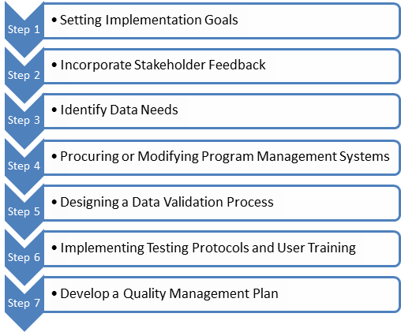

Implementation Guide
####################

To realize the benefits outlined above, you will need a well-designed
implementation plan.  The following sections will walk you through best
practices in implementing HPXML and provide guidance that can serve as a
starting point for an implementation plan in your jurisdiction.

It is important to recognize that each jurisdiction will have different goals,
market needs, and regulatory requirements that will guide the scope of your
HPXML project. However, you can still leverage the efforts other market actors
have already made in implementing HPXML. This can lower your individual
implementation costs and help to drive alignment between jurisdictions. The
following "steps to HPXML implementation" are designed to help you best
leverage existing efforts, while also making sure that you meet the individual
needs of your jurisdiction.

Steps to HPXML Implementation
*****************************

