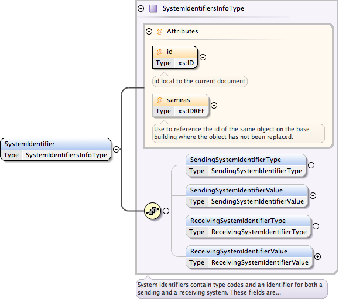

XML Element References
######################

XML documents are inherently hierarchical. This works out quite well for
describing many things regarding houses and home performance in general. For
instance, an AFUE is a property of a furnace which is part of an HVAC system on
a building. Many other relationships are not as strictly hierarchical, however.
An example of this would be the relationship between two furnaces in different
snapshots of the building where one furnace replaced the other. In that case,
there is no clear parent-child relationship. 

In HPXML we have the ability and requirement to identify many elements with
unique identifiers. This facilitates referential relationships between elements
throughout the document. This is done with the ``SystemIdentifier`` element.

.. _intra-doc-ref:

Intra-document references
*************************

The most common reference you will make is a reference that is internal to the
document. 

.. _id-idref:

ID and IDREF
============

Each element in the HPXML document that could need to be referenced has a
required ``SystemIdentifier`` sub-element which in turn has a required ``id``
attribute. That attribute has the
`xs:ID data type <http://www.w3.org/TR/2012/REC-xmlschema11-2-20120405/datatypes.html#ID>`_
in XML Schema. This provides a unique identifier for that element within the
document. This is similar to a primary key in a relational database.

When an element needs to reference another element it uses an
`xs:IDREF datatype <http://www.w3.org/TR/2012/REC-xmlschema11-2-20120405/datatypes.html#IDREF>`_,
which ensures that the id referenced exists somewhere within the document. One
simple example of this is how a window can reference which wall it is attached
to.

.. code-block:: xml
   :emphasize-lines: 19,25

   <?xml version="1.0" encoding="UTF-8"?>
   <HPXML xmlns="http://hpxmlonline.com/2014/6" schemaVersion="2.1">
       <XMLTransactionHeaderInformation>
           <XMLType></XMLType>
           <XMLGeneratedBy></XMLGeneratedBy>
           <CreatedDateAndTime>2014-09-03T16:06:24Z</CreatedDateAndTime>
           <Transaction>create</Transaction>
       </XMLTransactionHeaderInformation>
       <SoftwareInfo/>
       <Building>
           <BuildingID id="bldg1"/>
           <ProjectStatus>
               <EventType>audit</EventType>
           </ProjectStatus>
           <BuildingDetails>
               <Enclosure>
                   <Walls>
                       <Wall>
                           <SystemIdentifier id="wall1"/>
                       </Wall>
                   </Walls>
                   <Windows>
                       <Window>
                           <SystemIdentifier id="window1"/>
                           <AttachedToWall idref="wall1"/>
                       </Window>
                   </Windows>
               </Enclosure>
           </BuildingDetails>
       </Building>
   </HPXML>

.. _sameas:

sameas
======

The ``sameas`` attribute is a special IDREF that is used most predominantly in
the case of the :doc:`usecases/auditupgrade`. It serves to link components of
buildings between the pre- and post-upgrade ``Building`` nodes. Each
``Building`` node is a full description of the building and measures only
affect some of the components. For components that do not change it is useful
to have a way to indicate that they are the same item. 

.. code-block:: xml
   :emphasize-lines: 19,34

   <?xml version="1.0" encoding="UTF-8"?>
   <HPXML xmlns="http://hpxmlonline.com/2014/6" schemaVersion="2.1">
       <XMLTransactionHeaderInformation>
           <XMLType></XMLType>
           <XMLGeneratedBy></XMLGeneratedBy>
           <CreatedDateAndTime>2014-09-03T16:06:24Z</CreatedDateAndTime>
           <Transaction>create</Transaction>
       </XMLTransactionHeaderInformation>
       <SoftwareInfo/>
       <Building>
           <BuildingID id="bldg1"/>
           <ProjectStatus>
               <EventType>audit</EventType>
           </ProjectStatus>
           <BuildingDetails>
               <Enclosure>
                   <Walls>
                       <Wall>
                           <SystemIdentifier id="wall1"/>
                       </Wall>
                   </Walls>
               </Enclosure>
           </BuildingDetails>
       </Building>
       <Building>
           <BuildingID id="bldg1post"/>
           <ProjectStatus>
               <EventType>proposed workscope</EventType>
           </ProjectStatus>
           <BuildingDetails>
               <Enclosure>
                   <Walls>
                       <Wall>
                           <SystemIdentifier id="wall1post" sameas="wall1"/>
                       </Wall>
                   </Walls>
               </Enclosure>
           </BuildingDetails>
       </Building>
   </HPXML>

Inter-document references
*************************

The ``SystemIdentifier`` element also has sub-elements that facilitate
specifying identifiers for both a sending and receiving system. This way a
document could identify components based on where it is coming from and going
to. This feature currently isn't used much in lieu of the much simplified
:ref:`intra-doc-ref`.
