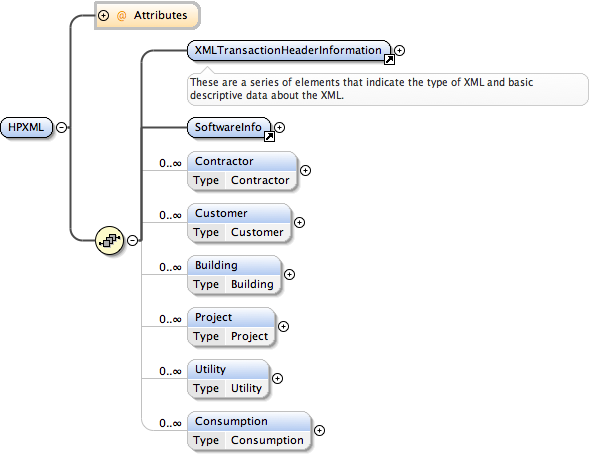

Document Structure
##################

.. contents:: Table of Contents

.. _top-level-nodes:

Top Level Nodes
***************

Each of the top level nodes described below with the exception of
:ref:`xmltransactionheader-node` and :ref:`softwareinfo-node` represent a
high-level block of information about a building or project that can be related
to other nodes to describe useful information about a building, the people and
businesses who interact with the building, and actions taken on the building.
The relationships between the top level nodes are defined with
:doc:`references` that can be used, for example, to associate a
:ref:`building-node` with a :ref:`project-node`, :ref:`consumption-node` with a
:ref:`building-node`, or a :ref:`contractor-node` with a :ref:`project-node`. 

The schema itself does not enforce the particular constraints for a
:doc:`usecases/index`, but rather provides a container for all the relevant
components and a referencing scheme to relate them. 

.. _xmltransactionheader-node:

XMLTransactionHeaderInformation
===============================

The ``XMLTransactionHeaderInformation`` element meta data about the HPXML file.

.. code-block:: xml

   <XMLTransactionHeaderInformation>
     <XMLType>auditretrofit</XMLType>
     <XMLGeneratedBy>Housesoft 1.0</XMLGeneratedBy>
     <CreatedDateAndTime>2014-09-02T17:32:12Z</CreatedDateAndTime>
     <Transaction>create</Transaction>
   </XMLTransactionHeaderInformation>

``XMLType`` is generally unused and may be deprecated in the future.

``XMLGeneratedBy`` is often used to transmit the name of the software that
generated the HPXML file. It may also be deprecated in the future due to its
redundancy with :ref:`softwareinfo-node`.

``CreatedDateAndTime`` is the date and time the file was generated in the ISO
8601 format. 

``Transaction`` describes whether this is a new document or
an update to a previous one. 

.. _softwareinfo-node:

SoftwareInfo
============

``SoftwareInfo`` provides a place to transmit information about the software
used to generate the HPXML.

.. code-block:: xml

   <SoftwareInfo>
     <SoftwareProgramUsed>WOPR</SoftwareProgramUsed>
     <SoftwareProgramVersion>1.0</SoftwareProgramVersion>
   </SoftwareInfo>    

.. _contractor-node:

Contractor
==========

The ``Contractor`` node describes a business that the customer works with to do
an audit or upgrade [I'M AFRAID THIS CHANGE HAS TO HAPPEN GLOBALLY. WE DON'T USE "RETROFIT".] to their building. 

.. _customer-node:

Customer
========

A customer is the owner, tenant, or some other person who has a vested interest
in the house being described and worked on. This node is a place to describe
that person, their contact information, and their relation to the building.

.. _building-node:

Building
========

The ``Building`` node describes the physical characteristics of a building at a
point in time past, present, or future.  

.. _project-node:

Project
=======

The ``Project`` node describes work that has been done or is to be done to a
:ref:`building-node`. The measures described can have references pointing to
specific components on the building and what was changed between the pre- and
post-retrofit states and associated costs. 

.. _utility-node:

Utility
=======

The ``Utility`` node represents a utility company.

.. _consumption-node:

Consumption
===========

The ``Consumption`` node stores and represents the energy and/or water use of a
building. It can contain high resolution electric smart meter data down to the
fuel oil fill up that happens once or twice a year. 

.. _extension-elements:

Extension Elements
******************

Because it is impossible to foresee every possible data point that will ever
need to be collected and transmitted about a house or retrofit, most elements
in HPXML contain an ``extension`` element containing an ``<xs:any>``
designation. That allows any element from any namespace to be inserted there.
This is to facilitate transfer of data elements not available in the standard. 

.. code-block:: xml
   
   <extension>
      <QuantityWoodChucked>as much wood as a wood chuck could chuck</QuantityWoodChucked>
   </extension>

.. warning::

   Please exercise extreme caution and discretion when you consider implementing
   ``extension`` elements. Often times the temptation to use them happens when a
   difference arises between the way your software and/or Home Performance
   program represents a certain data field and the way HPXML represents it. It
   is crucial in these cases to either map your data into HPXML or change the
   way you represent it internally to conform to the HPXML standard. **If each
   software vendor and Home Performance program extends HPXML in non-standard
   ways, the value proposition of the standard is nullified.**

   If there is no possible way to map your data into existing HPXML data fields,
   please contact BPI Working Group 5 (a.k.a. the HPXML working group) before
   implementing an extension. The working group would prefer to extend the
   standard for the benefit of everyone and avoid the use of extensions wherever
   possible. Often times you will not be the only one with the need for a
   particular element that was overlooked in the standard. By participating in
   the working group and lobbying for the elements you need you can enhance the
   value of HPXML for all parties.
